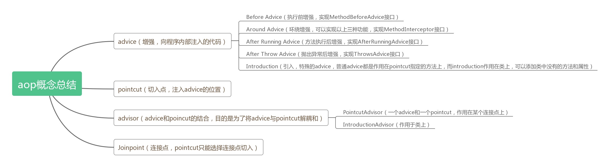
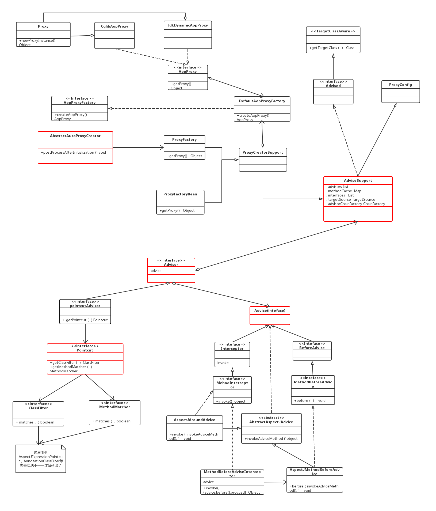
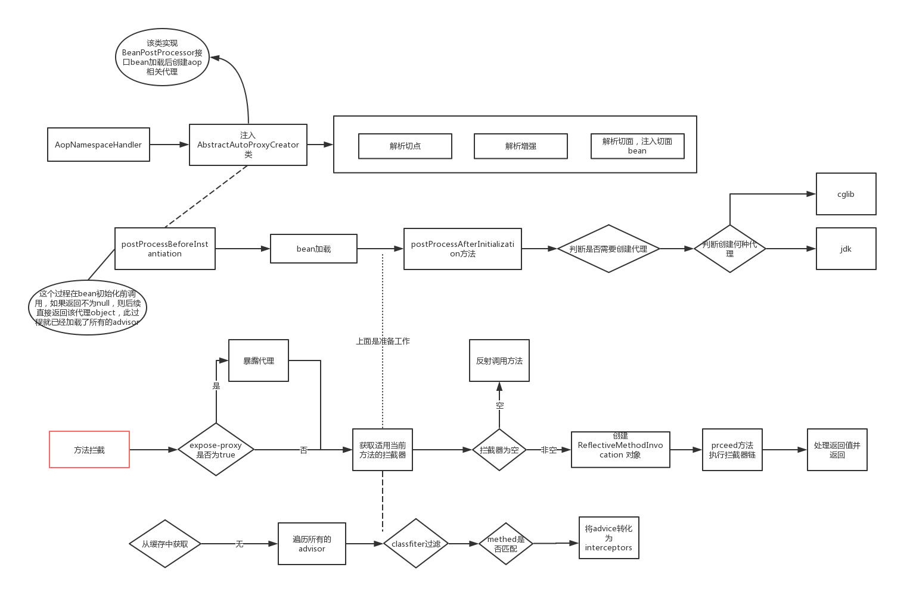
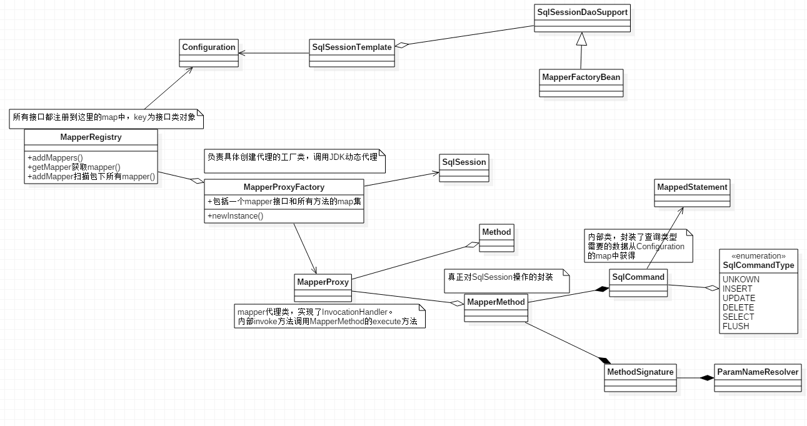

#AOP基础及原理介绍
##问题
1. 面向切面编程的理解?

2. 切面的执行顺序结果是什么？俩个切面重合的时候呢？
```java 
    @Around
    public void around(){
        System.out.println("A1")
        joinPoint.proceed()
        System.out.println("A2")
    }
    @Before
    public void before(){
        System.out.println("A3")
    }
    @After
    public void after(){
        System.out.println("A4");
    }
    @AfterReturning
    public void AfterReturning(){
        System.out.println("A5");
    }
```java
3. jdk代理和cglib代理的区别?


4. aop同一个类里调用是否生效?

###基础概念


###springAop原理
aop简版uml类图

aop创建代理和方法执行流程图


###mybaties aop

MapperRegistry:addMappers方法将包名下每个mapper类创建一个MapperProxyFactory,放入map中
MapperProxyFactory:创建一个mapperProxy代理类
MapperProxy:实现了InvocationHandler主要调用MapperMethod的execute
MapperMethod:创建需要三个参数：DAO接口本身，方法类，Configuration对象 内部新建SqlCommand，MethodSignature俩个类

###自己实现aop
问题:自己实现一套类似于spring或者mybaties的aop 哪些类是必须的?
1:创建代理类
2:一个methodInvoce的实现类 当作拦截器
3:过滤工具类 用来匹配切点
4:解析xml或者注解的工具类
5:详见代码